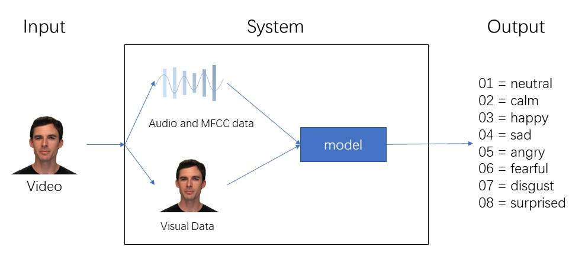

# End-to-End multimodal emotion recognition
## About
I am a front-end engineer, due to some reasons need to do a front-end multi-modal emotion recognition system, but I am a python novice. Fortunately, I found @katerynaCh's open source library, which helped me a lot, [click here&star it](https://github.com/katerynaCh/multimodal-emotion-recognition). While her open source library covers this code in enough detail, I just reorganized it so that the code can output result directly from the raw video file

## Dependencies
Please use `pip install -r requirements.txt` to install the dependencies
## Preparation&Usage
1. You need to download pth files `EfficientFace_Trained_on_AffectNet7.pth.tar` and `lt_1head_moddrop_2.pth` according to her library
2. Orgnize the file structure like this
    ```
    -root
        -models
            lt_1head_moddrop_2.pth
            ...
        -raw_data
            your_video.mp4
        EfficientFace_Trained_on_AffectNet7.pth.tar
        ...
        main.py
    ```
3. Due to I fixed the options. You can run `python main.py` directly.
## Thanks Again
This work has been bothering me for a long time,
because I don't know deep learning and python,
and most of the open source code found online requires training,
which my computer can't support me to complete. Thanks for the code and the trained model shared by @katerynaCh